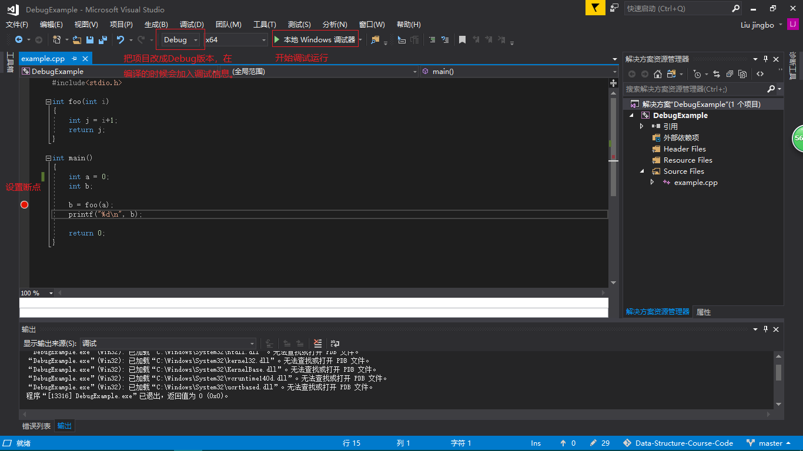
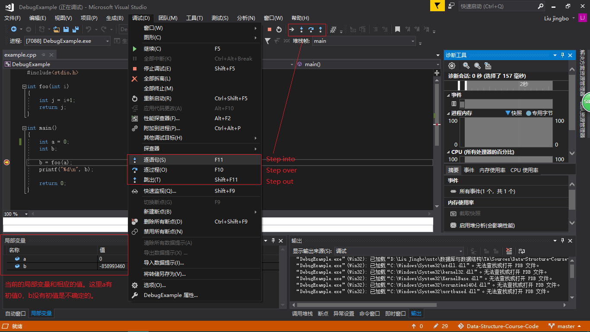
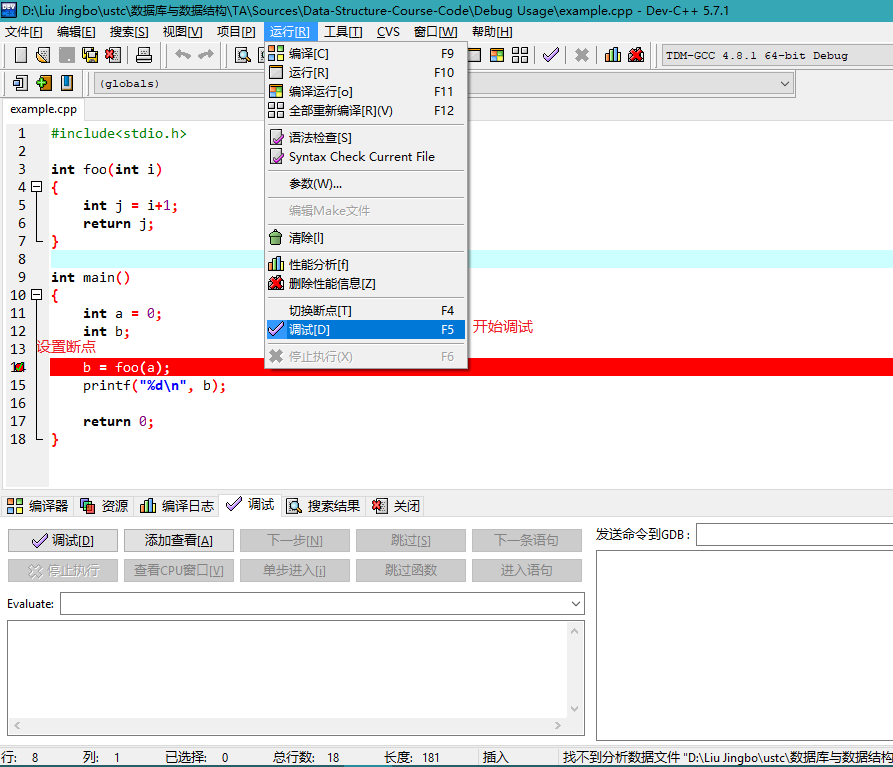
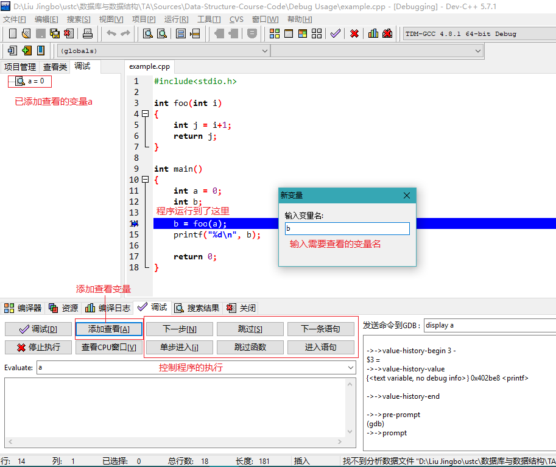

# How to debug code
IDE调试功能介绍，使用程序的调试功能能够帮助我们快速定位、解决问题。

## 基本概念
- Breakpoint 断点：在程序代码的某行加入断点，在调试运行的时候，程序将会在执行到改行的时
候暂停下来，这个时候可以查看相应变量的当前值和调用关系等程序运行情况。
- Step over 单步执行：每次运行一行代码。
- Step into 单步进入：每次运行一行代码，但遇到函数的时候会进入到函数内部。
- Step out 跳出：跳出当前所在函数。
- 变量查看窗口：可以添加需要查看的变量，会显示变量的当前值。

## Visual Studio
### 添加断点，开始调试

### 查看变量，控制程序执行

## Dev-C++
### 添加断点，开始调试

### 查看变量，控制程序执行

## Visual C++

## XCode

## gdb
