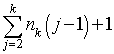

# 作业四参考答案

## 6.5


根结点贡献一个叶子结点，一个度为j的结点贡献(j-1)个叶子结点。

## 6.6


## 6.15
```c
// 复制二叉树src到des
Status CopyBiTree(BiTree src, BiTree &des)
{
    if(!BiTree) {des=NULL; return OK;}
    // Copy root
    des = MakeNode(BiTNode);
    des->data = src->data;
    // Copy left child and right child
    CopyBiTree(src->lchild, des->lchild);
    CopyBiTree(src->rchild, des->rchild);
    return OK;
} // CopyBiTree
```

在这里参数src和des分别是源二叉树和目的二叉树，
大家定义变量名的时候需要最好有一定含义。


## 6.18
```c
// 判断二叉树T是否为完全二叉树
Status isCompleteBiTree(BiTree T)
{
    Status isTrue = TRUE;   // 是否为完全二叉树
    int isLeaf = 0;         // 是否为空外结点
    if(!T) return TRUE;
    // 层序遍历二叉树T
    InitQueue(Q); EnQueue(Q,T);  // 初始化队列，T入队
    while(!EmptyQueue(Q)){
        DeQueue(Q,s);
        if(s && !isLeaf){  // 非空左右孩子入队
            EnQueue(Q,s->lchild); EnQueue(Q,s->rchild);
        }
        else{  // 之后队列中的结点都为空结点
            isLeaf = 1;
            if(s){isTrue = FALSE; break;}
        }//else
    }//while

    DestoryQueue(Q);
    return isTrue;
} // isCompleteBiTree
```

最后的时候需要记得销毁之前初始化的队列Q，回收内存空间。
