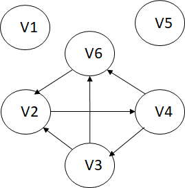

# 作业六参考答案

## 6.14
1. Huffman树

2. Huffman编码
  - a: 0010
  - b: 10
  - c: 00000
  - d: 0001
  - e: 01
  - f: 00001
  - g: 11
  - h: 0011

3. 处理之后的电文的二进制位数 
7\*4 + 19\*2 + 2\*5 + 6\*4 + 32\*2 + 3\*5 + 21\*2 +10\*4 = 261

## 7.1
1. 邻接矩阵

2. 邻接表示

3. 逆邻接表

4. 所有强连通分量

