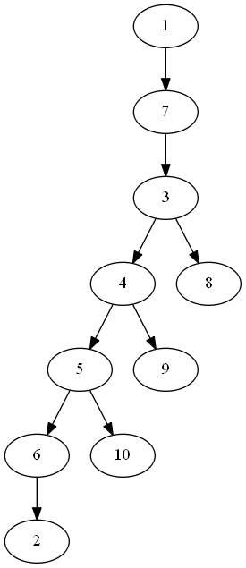

# 作业七参考答案

## 7.2
- DFS: 
  - 1,7,3,4,5,6,2,10,9,8
  - 

- BFS: 
  - 1,7,9,3,10,5,4,8,6,2
  - 

## 7.3
1. 邻接矩阵和Prim算法

2. 邻接表和Kruskal算法

## 7.4
- V1,V5,V6,V2,V3,V4
- V5,V1,V6,V2,V3,V4
- V5,V6,V1,V2,V3,V4

## 7.5

## 9.3
- 查找成功：ASL = (1\*1+2\*2+4\*3+8\*4+2\*5)/17 = 59/17
- 查找失败：ASL = (14\*4+4\*5)/18 = 38/9
- 判定树：

## 9.4
1. 平均查找长度
  - 从表尾开始：ASL = 0.1\*12+0.25\*11+...+0.07\*1 = 7.57
  - 从表头开始：ASL = 0.1\*1+0.25\*2+...+0.07\*12 = 5.43

2. 二叉排序树
按照字母表顺序

3. 平均查找长度：
ASL = 1\*0.1+2\*(0.25+0.05)+3\*(0.13+0.06+0.01)+4\*(0.07+0.11+0.02)+5\*(0.07+0.03)+6\*0.1 = 3.2

4. 删除之后的二叉排序树

