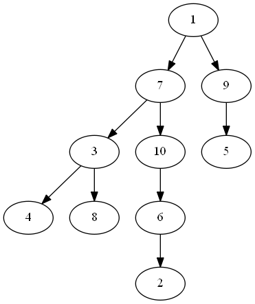
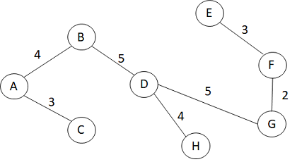

# 作业七参考答案

## 7.2
- DFS: 
  - 1,7,3,4,5,6,2,10,9,8
  - 

- BFS: 
  - 1,7,9,3,10,5,4,8,6,2
  - 

## 7.3
1. 邻接矩阵和Prim算法

2. 邻接表和Kruskal算法

## 7.4
- V1,V5,V6,V2,V3,V4
- V5,V1,V6,V2,V3,V4
- V5,V6,V1,V2,V3,V4

## 7.5

